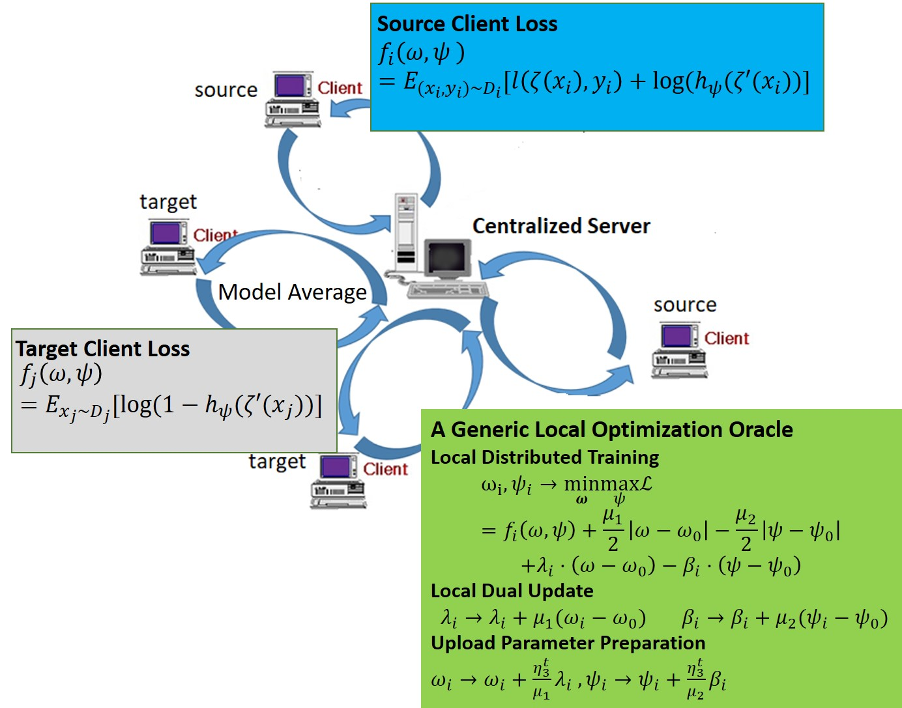

This repository contains the code accompanying the AAMAS2023 paper  "
FedMM: A Communication Efficient Solver for Federated Adversarial Domain Adaptation" Paper[link](https://arxiv.org/pdf/2110.08477.pdf): 



#### Requirements to run the code:
---

1. Python 3.7
2. Tensorflow 1.14.0
3. numpy 1.20.3
4. tqdm

#### Download dataset:
---

Download mnistm data:
```
curl -L -O http://www.eecs.berkeley.edu/Research/Projects/CS/vision/grouping/BSR/BSR_bsds500.tgz
```
Preprocess mnistm dataset
```
python create_mnistm.py 
```

#### Experiments on Federated Domain Adaptation:
---
Usage for the Proposed FedMM on DANN loss:
```
python train.py -max_iter=15000 -lambda1_decay=1.05 -adv_loss='DANN' 
```

Usage for the Proposed FedMM on MDD loss: 
```
python train.py -max_iter=50000 -lambda1_decay=1.01 -adv_loss='MDD' 
```

Usage for the Proposed FedMM on CDAN loss 
```
python train.py -max_iter=30000 -lambda1_decay=1.02 -adv_loss='CDAN'
```

### Reference
---

```
@inproceedings{shen2023fedmm,
  title={FedMM: A Communication Efficient Solver for Federated Adversarial Domain Adaptation},
  author={Shen, Yan and Du, Jian and Zhao, Han and Ji, Zhanghexuan and Ma, Chunwei and Gao, Mingchen},
  booktitle={Proceedings of the 2023 International Conference on Autonomous Agents and Multiagent Systems},
  pages={1808--1816},
  year={2023}
}


